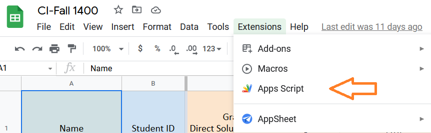

## Email Sender

In order to send automated emails to people and also where there is a need of reading data from google sheets, you can use Apps script which is a built-in extension in google sheets. You can send your emails in your favorite ```HTML``` templates and use ```gs``` to use variables inside your ```HTML``` template.

To do this, follow this instruction.

1. First, go to google sheets and choose ```Apps Script``` from ```Extensions``` navigation menu.



2. Copy and Paste the ```script.gs``` file from this repository to ```Code.gs``` in Apps script.

I have explaned some parts of code below.

```js
const headers = ws.getRange('A2:H49').getDisplayValues()//get table headers name;
```
The ```getRange``` function gets the range of your cells name. For instance, if you want your code to read data from below image, you should enter ```